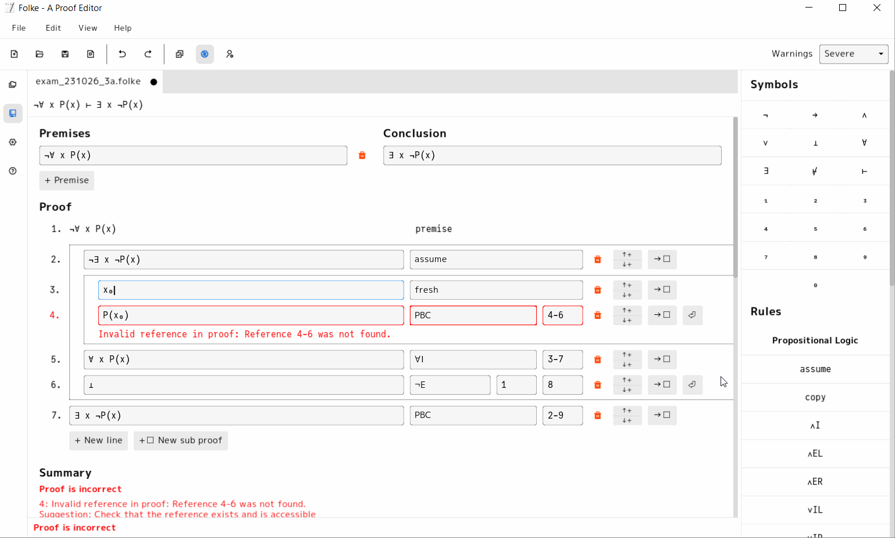

# Folke

Folke is an interactive proof editor for propositional and first-order logic




## Download
It will soon be possible to download the editor under [Releases](https://github.com/lambducas/folke/releases).

## Build the program yourself
It is also possible to build the program yourself by downloading the repository and following the instructions below.

### Linux
The following dependencies are required:
```bash
sudo apt-get install libsdl2-dev
sudo apt-get install libglew-dev
sudo apt-get install libfreetype6-dev
sudo apt-get install libgtk-3-dev

cabal install BNFC
cabal install alex
cabal install happy
```

Set up BNFC
```bash
make
```

To build the library, run the following command:
```bash
cabal build
```

### Mac OS
The following dependencies are required:
```bash
brew install sdl2
brew install glew
brew install freetype
brew install gtk+3

cabal install BNFC
cabal install alex
cabal install happy
```

Set up BNFC
```bash
make
```

To build the library, run the following command:
```bash
cabal build
```

### Windows
1. Download GHCUP if its not already installed
1. Start mingw64 terminal: `C:\ghcup\msys64\mingw64.exe`
1. Run all these commands in the mingw64 terminal
    ```bash
    pacman -S mingw-w64-x86_64-pkg-config
    pacman -S mingw-w64-x86_64-SDL2
    pacman -S mingw-w64-x86_64-freeglut
    pacman -S mingw-w64-x86_64-glew
    pacman -S mingw-w64-x86_64-freetype
    pacman -S make
    ```
1. Install BNFC next. Run these commands in the windows command prompt:
    ```bash
    ghcup run --mingw-path -- cabal install BNFC
    ghcup run --mingw-path -- cabal install alex
    ghcup run --mingw-path -- cabal install happy
    ```
    (`ghcup run --mingw-path` sets the PATH temporarily so cabal finds pkg-config)
1. Run make to setup BNFC. GHC might fail to compile saying packages are hidden but this is ok.
    ```bash
    ghcup run --mingw-path -- make
    ```
1. Build project (run twice if you get permission error first time):
    ```bash
    ghcup run --mingw-path -- cabal build
    ```
    **NOTE:** SDL2 might fail to build with `ld.lld: error: undefined symbol: __stack_chk_fail`. Check workaround below.
1. Run the project
    ```bash
    ghcup run --mingw-path -- cabal build
    cabal run
    ```

#### SDL2 build error solution
If sdl2 fails with `error: ld.lld: error: undefined symbol: __stack_chk_fail` (from [this](https://github.com/haskell-game/sdl2/issues/277#issuecomment-2283057736) github commen):
1. Download `SDL2-devel-2.30.6-mingw.zip` from [this repo](https://github.com/libsdl-org/SDL/releases/tag/release-2.30.6)
1. Unzip and place the folder `SDL2-2.30.6` in Downloads or somewhere else. Make sure it contains a folder called `x86_64-w64-mingw32` with subfolders: bin, include, lib and share
1. Run the following 3 commands in a mingw64 terminal (replace `your-user-name` with your actual username and make sure the first path of `cp` points to where you put the folder)
    ```bash
    cd /c/ghcup/msys64
    cp /c/Users/your-user-name/Downloads/SDL2-2.30.6/x86_64-w64-mingw32/lib/* -r /mingw64/lib/
    cp /c/Users/your-user-name/Downloads/SDL2-2.30.6/x86_64-w64-mingw32/include/* -r /mingw64/include/
    cp /c/Users/your-user-name/Downloads/SDL2-2.30.6/x86_64-w64-mingw32/bin/* -r /mingw64/bin/
    ```
1. Run `ghcup run --mingw-path -- cabal build` again and it should work.

## Usage
To run Folke after building:

```bash
cabal run
```

## Testing
To run the test suite:

```bash
cabal test
```

## Contributing
Contributions are welcome!

## License
This project is licensed under the [BSD-3 License](LICENSE).

## Bachelor thesis
Read our bachelor thesis in Swedish [here](folke.pdf)